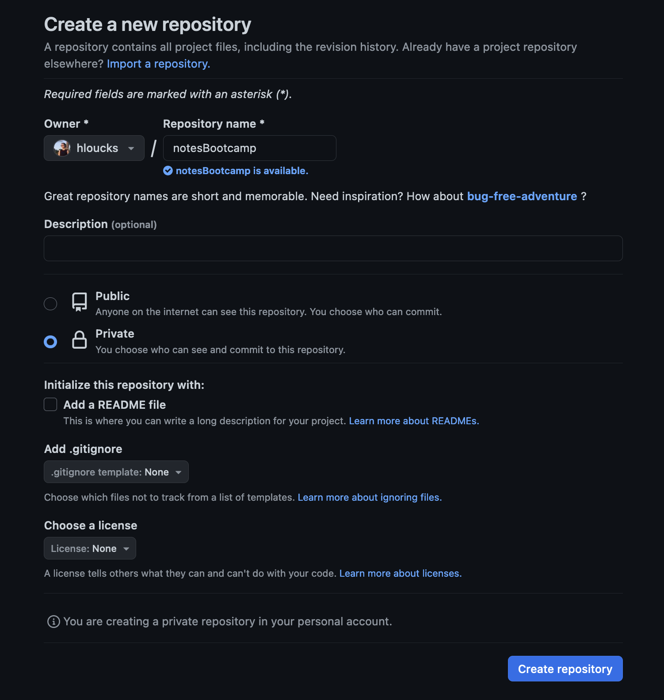

# BME Bootcamp 2023 Git Tutorial using google cloud console
Tutorial modeled on [this Plos tutorial](https://journals.plos.org/ploscompbiol/article?id=10.1371/journal.pcbi.1004668)


## 0. Log in to Github 
Ensure that you have a valid account and that you know your username and the name that you have associated with the account.

Once you have done that please add your github username to this [google sheet](https://docs.google.com/spreadsheets/d/1IICoX3bIKXpZ8lqVnLEcaWMxRTKf-he1C1VGnH7Rpp4/edit?usp=sharing) so that I can add you to our collaborative repository for step 6. 

## 1. Log in to [google cloud console](https://www.google.com/url?sa=t&rct=j&q=&esrc=s&source=web&cd=&cad=rja&uact=8&ved=2ahUKEwjwju2Gkq2BAxX3NEQIHWNABa8QFnoECAcQAQ&url=https%3A%2F%2Fconsole.cloud.google.com%2F&usg=AOvVaw1GxwHR1WZnDu0xsR-djCrv&opi=89978449)

In the upper right corner there is a small box with ">_" click on that and activate the cloud shell.

## 2. Create your directory 
On the google cloud console command line, run the following commands. For the first part of this tutorial we are going to pretend that we are creating a repository for storing notes in a markdown file. This is a really great way of keeping a lab notebook that ensures everything is dated, and that it is stored remotely so if something happens to your laptop you don't lose your notes. 

Here is an example of what my notes repo looks like 


Now make a directory and a notes file.
```
mkdir notes
cd notes/
nano Labnotebook.md
```
Copy the text below into Labnotebook.md. We are using a markup language called Markdown for this purpose. This is the language we use to create those neatly formatted README pages you may have seen on github (and this tutorial). For more info on markdown [here](https://www.writethedocs.org/guide/writing/markdown/) is an intro you can look at later for formatting your own markdown files. 

```
## 9/18/23
BME Bootcamp git tutorial 
```


## 3. Configure git with your user information - sub your name in the quotes

```
git config --global user.name "Firstname Lastname"

git config --global user.email "user@domain"
```

## 4. Initialize git and create the repository 

```
git init 
```

You should see the following message
```
Initialized empty Git repository in /home/hailloucks/notes/.git/
```
Then run 
```
git add Labnotebook.md
git commit -m "first commit"
git branch -M main
```

Now go back to github on your web browser and click the + sign and "New repository"

Set the repository name to be the same as the name of the directory you executed `git init` in, which should be `notes `

I also recomend setting this to private as you likely want your research notes to not be published publically.  
Click "Create Repository" 



Now copy the HTTPS link for the repo you've just created and sub it in for the URL in the command below 

```
git remote add origin https://github.com/username/notes.git
```
For the next step you will need to be logged in to your github account. You can do this by running 
```
gh auth login
```
And select GitHub.com, HTTPS, Yes, and whatever method you would like to login with. Login with the web browser might be easier, and then follow the instructions. 

This will save your login information so that you don't have to provide your credentials every time you push to a repo. If you don't want to save your credentials you can also create a personal access token which you provide every time you log in more information [here](https://docs.github.com/en/authentication/keeping-your-account-and-data-secure/managing-your-personal-access-tokens)

Now we are finally ready to push our file to our new repo!  

```
git push -u origin main
```

Now refresh your github repo in the browser, you should be able to see your file in the browser and look at it. 


## 5. Creating new files and tracking changes 
Alright now lets make some changes to our existing lab notebook and add a new file to our repository. Back on the google command line open up your Lab notebook with `nano` and add some notes.  

Let's also create a new file for noting useful bash commands we might want to reference in the future. Let's create a file called Bashtricks.md and add some of our bash commands to it to reference later.  

```
nano Bashtricks.md 
```

Here are a few commands I've found useful you can copy in to the file - you can add your own as you work 

```
### view total disk space used by directories in current directory
du -sh ./*   

### To time a script 
`time Script.sh`

## Create a Screen with name
screen -S [name]

## reconect to a screen 
screen -r [name]

## git basics 
git add filename
git commit -m "Message about commit"
git push 
```

Now that we have created a new file we can do the same process of adding, committing, and pushing it 

```
git add Bashtricks.md
git commit -m "Adding bash tricks file"
git push
```

Once again if you check the web interface you should see the updated repository with your new file. The process will be the same whether you've created a new file or just want to commit some changes 


## 6. Creating a Branch in an existing repository and making changes on the branch 

So far you've created and made changes in your own personal repository. This is great to be familiar with for keeping your own files in order, but is not the only use for version control. One of the most powerful use cases for git is when you have many people working on a project who all are contributing to a code base. This is where things can get tricky, as you want to be able to make changes without messing up code that someone else is working on. [Here](https://www.w3docs.com/snippets/git/how-to-create-a-remote-branch-in-git.html) is more information on creating a remote branch. 

We are going to be working on this repository https://github.com/hloucks/BootcampGitTutorial where we will clone the repo, create a new branch, then push our changes on the new branch. 

Before you can push to this repo you will need to accept my invitation to join the repo. Check your notifications on github and accept the invitation to edit the BootcampGitTutorial repo.

```
cd
gh repo clone hloucks/BootcampGitTutorial
cd BootcampGitTutorial


# create a new branch with your name 
git checkout -b Namebranch

# now you create a file with your name and add some text in the file 
nano myname.txt 
git add myname.txt
git commit -m "My Name"

# now push to the branch that you created 
git push -u origin Namebranch
```

It should look like this 


Now if you look back at github in your browser you should be able to find your branch. In the web interface click on your branch and then "New pull request" to create a pull request. Add some notes about the time and context, then. When you are working collaboratively and are ready to merge your code in to the main code base this is how you can start that process. Now the owner of the repo can review and merge your code if there are no issues. The pull request is also an opportunity for collaborators to view your code, so they will likely provide feedback on the readability and style of your changes. 

