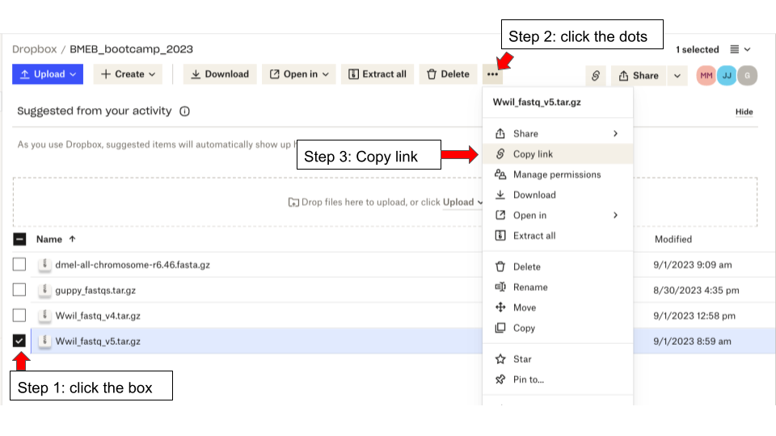

# De-novo assembly of a Wolbachia genome

This document contains instructions for generating a de-novo assembly of a wolbachia genome for BMEB bootcamp 2023. This is part 1 of the computational portion of the bootcamp.

I recommend that you clone this repository to your local computer, and open up this document in a text editor. That way you can save any changes you make to the code in this tutorial (like file paths)

> The output files for all steps in this tutorial can be found in the [bootcamp dropbox](https://www.dropbox.com/scl/fo/7cdhhpvc0vwxaawr36iff/h?rlkey=2o6mokx3yf5kkb3upymjab5yr&dl=0). If you get stuck and fall behind, feel free to use these files to move ahead.  

## 0. Log onto the hummingbird server and create a project directory

You can access the hummingbird server with your UCSC username and Gold password. Please see the humming bird wiki on ["Getting Started"](https://hummingbird.ucsc.edu/getting-started/) for more details. (Feel free to run this analysis on your local computer if you prefer, but note that we may not be familiar with your operating system if you need help.)

Open your terminal and type:
```
ssh <your_cruzid>@hb.ucsc.edu
```

You should be in your home directory. You can check the directory you are in by typing `pwd`. This stands for "print working directory" Mine looks like this:

```
[mmastora@hb ~]$ pwd
/hb/home/mmastora
```

Create a new folder in your home directory for this analysis. Its good practice to keep your directories well organized.

```
mkdir bootcamp2023
```

Change into this new directory for the rest of the analysis
```
cd bootcamp2023
```

> Note: If you are new to linux commands, please refer to the [provided reference slides](https://docs.google.com/presentation/d/1hjIfozfQkjL4gj1eUtvBqgzpWERAkF8Uw43ToAQSxa8/edit#slide=id.p)


## 1. Download fastq files produced by the Guppy basecaller

The fastq files that were generated from the nanopore library you created are [located here](). The fastq files from our preliminary nanopore experiments are [located in this dropbox folder](https://www.dropbox.com/scl/fo/7cdhhpvc0vwxaawr36iff/h?rlkey=2o6mokx3yf5kkb3upymjab5yr&dl=0). 

The fastq files are in this file: `Wwil_fastq.tar.gz`

Copy the link to this file from the dropbox website.

To get the correct link, you need to select the box next to the file, click on the three dots icon at the top, then click on "Copy link"



To download the files to hummingbird, go back to your terminal and type `wget -O Wwil_fastq.tar.gz` then add a space and paste the link from dropbox. The command should look like this:

```
wget -O Wwil_fastq.tar.gz <[link from dropbox]>

# example
wget -O Wwil_fastq.tar.gz https://www.dropbox.com/scl/fi/o1e00wivre76rv004036w/Wwil_fastq.tar.gz?rlkey=urd8unwxfjev31qf721ed65s3&dl=0
```
To upload files from your local machine, first download the files from Dropbox, open a new terminal session (not logged in to hummingbird) and then use the following command to copy files over to hummingbird. 

```
scp /path/to/file  <your_cruzid>@hb.ucsc.edu>:/path/to/destination/

#example
scp Downloads/Wwil_fastq.tar.gz jomojaco@hb.ucsc.edu:/home/bootcamp/
```


Check that the file is in your directory with `ls`. Now, uncompress it with:

```
tar -xvf Wwil_fastq.tar.gz
```
You should now have a new folder in your current directory titled `Wwil_fastq`. You can confirm that the fastq files are inside of it with:
```
ls Wwil_fastq/
```

## 2. Create a conda environment for assembly.

We need to install the Flye assembler onto hummingbird to run our assembly. We can do this using conda, which is already installed on hummingbird. If you are working on your own computer, you'll need to install conda. You can do this on the command line by downloading the conda installer [here](https://docs.conda.io/en/latest/miniconda.html#latest-miniconda-installer-links), then running `bash <Miniconda_blah_blah.sh>`


First, load conda
```
module load miniconda3.9
```

Now, we create a new conda environment and install the latest flye in it.

```
conda create -n flye_29 -c conda-forge -c bioconda flye=2.9
```
To activate this environment, run
```
conda activate flye_29
```
You'll know you have activated the environment if `(flye_29)` is at the beginning of your command prompt, like this
```
(flye_29) [mmastora@hb progs]$
```
You can test that flye works by running:
```
flye -h
```

## 3. Preprocessing data

First, we need to combine all our fastq files into one file.
```
cd Wwil_fastq/

cat *.fastq.gz > merged.fastq.gz
```

We need to make sure to remove any duplicate fastq files from the sequencing reads, too.

We can use `seqkit` for this. We're going to install it on hummingbird using conda.

```
conda install -c bioconda seqkit
conda activate seqkit
```

Now run
```
seqkit rmdup merged.fastq.gz -o merged.rmdup.fastq.gz
```

## 4. Running Flye assembler

The Flye [manual](https://github.com/fenderglass/Flye/blob/flye/docs/USAGE.md) gives a whole list of all the possible parameters we can give Flye. You can also check these by running `flye -h` Please read through the section in the manual giving descriptions of these parameters [(here)](https://github.com/fenderglass/Flye/blob/flye/docs/USAGE.md#-parameter-descriptions) and make sure you understand why this is the command we need to run:

> Note: Flye took me 43 minutes to run on 1 thread. Hummingbird has 48 threads available. Lets keep everyone to 1 thread `-t 1` so we don't completely take over hummingbird. I'd reccommend running this in a screen.

```
# move back to your bootcamp2023 directory
cd ../

# create output directory for flye
mkdir flye

# activate conda environment
conda activate flye_29

# run flye assembler
time flye --nano-hq /hb/home/mmastora/bootcamp2023/Wwil_fastq/merged.rmdup.fastq.gz -t 1 --out-dir /hb/home/mmastora/bootcamp2023/flye/
```

Take a look at the output of Flye. You should see the following files in your directory
```
[mmastora@hb flye]$ ls
00-assembly   30-contigger    assembly_graph.gfa  flye.log
10-consensus  40-polishing    assembly_graph.gv   params.json
20-repeat     assembly.fasta  assembly_info.txt
```

Consult the Flye manual about what these files represent. Which one contains the assembly? Discuss these files as a group.

> Hint: take a look in `assembly_info.txt`

## 5. Assembly quality control

We will use the tool [Quast](https://quast.sourceforge.net/docs/manual.html#sec2.1) to assess the quality of our genome assembly.

First, lets install it in a new conda environment
```
module load miniconda3.9

conda create -n quast -c conda-forge -c bioconda quast
```
Running Quast:
```
conda activate quast
mkdir quast

time quast /hb/home/mmastora/bootcamp2023/flye/assembly.fasta --nanopore /hb/home/mmastora/bootcamp2023/Wwil_fastq/merged.rmdup.fastq.gz -t 1 -o /hb/home/mmastora/bootcamp2023/quast --circos --k-mer-stats --glimmer --conserved-genes-finding --rna-finding --est-ref-size 1200000
```
> Quast took me 8 minutes to run on 1 thread.

Take some time to research the metrics and figures that QUAST produces, and discuss as a group. Which ones are informative about the quality of our assembly?

- [Quast Github](https://github.com/ablab/quast)
- [Quast Manual](https://quast.sourceforge.net/docs/manual.html#sec2.1)

I would reccommend downloading the quast output to your personal computer, so you can open all the figures it produces. To do this, open a new terminal window (on your personal computer, NOT on hummingbird) and run the following command (changing my username to yours)

```
scp -r mmastora@hb.ucsc.edu:/hb/home/mmastora/bootcamp2023/quast/ .
```

What do the metrics and plots output by Quast tell us about the quality and completeness of our assembly? Do we have enough information to say whether our assembly is "good"?

## 6. Independent project and presentation

For the rest of bootcamp, your task is to find an interesting analysis to do with our Wolbachia data. You may use the assembly, the sequencing reads, or both. This is **purposefully open-ended**, to give you practice with developing your own question or hypothesis, figuring out the research steps necessary to answer it, executing those steps, and presenting your work to others.  

We DO NOT expect everyone to come up with incredible groundbreaking results. The **worst thing you could do** would be to give up and not present anything, just because you couldn't get an analysis to work. Share your project idea, what you tried, what worked and what didn't, and what you learned from the project if you aren't able to get results for this independent portion.

To get you started, we've come up with some project ideas you may use for the independent portion, but coming up with your own idea is highly encouraged! Follow your interests.

#### Project ideas:

- Find additional assembly tools and run them on our data. Compare their quality against our Flye assembly. Which assembly tool produces the best quality assembly?
- Implement an algorithm to walk along the repeat graph produced by Flye `assembly_graph.gfa` and produce an assembly sequence. Compare your assembly to the one Flye produces.
- Characterize the repetitive elements in our assembly (Hint: RepeatMasker)
- Build a phylogeny with our Wolbachia assembly and other species (Hint: USHER)
- Comparative genomics: [Mauve](https://darlinglab.org/mauve/mauve.html), [Mummer](https://mummer.sourceforge.net) Are there interesting variations between our assembly and other relevant datasets?
- Take the repeat graph produced by Flye and visualize it in [Bandage](https://github.com/rrwick/Bandage). What does this visualization show you about the repeat structure and quality of the assembly?
- Present an in depth dive into QUAST performance metrics. Generate informative plots about the quality of our assemblies. Can you find any other tools to evaluate the quality of our assembly?
